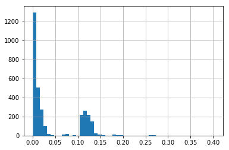
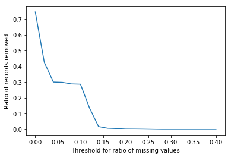

Supplemental Data Cleaning
==========================

.. code:: ipython3

    """ Notebook Setup/Imports
    """
    
    # Project path setup
    from pathlib import Path
    project_dir = Path(__name__).resolve().parents[1]
    
    # Library import
    import pandas as pd
    import numpy as np
    import matplotlib.pyplot as plt
    
    # Print strings as markdown
    from IPython.display import Markdown
    
    # Data variables from previous notebook
    dataset = pd.read_pickle(Path.joinpath(project_dir, "data/production/data.pickle"))
    data_dictionary = pd.read_pickle(Path.joinpath(project_dir, "data/production/data_dictionary.pickle"))

Missing Data
------------

Puerto Rico
~~~~~~~~~~~

The only data we have for PR is unemployment. We’ll have to drop those
records (state fips 72xxx)

.. code:: ipython3

    dataset = dataset.loc[:72000]

.. code:: ipython3

    dataset.drop(["POV04_2017", "CI90LB04_2017", "CI90UB04_2017"], axis="columns", inplace=True)

.. code:: ipython3

    des = dataset.describe().transpose()
    missing = des[des['count'] < 3100].sort_values('count',ascending=True)
    missing.head(10)

.. raw:: html

    

    
    <table border="1" class="dataframe">
      <thead>
        <tr style="text-align: right;">
          <th></th>
          <th>count</th>
          <th>mean</th>
          <th>std</th>
          <th>min</th>
          <th>25%</th>
          <th>50%</th>
          <th>75%</th>
          <th>max</th>
        </tr>
      </thead>
      <tbody>
        <tr>
          <th>CI90UB04P_2017</th>
          <td>0.0</td>
          <td>NaN</td>
          <td>NaN</td>
          <td>NaN</td>
          <td>NaN</td>
          <td>NaN</td>
          <td>NaN</td>
          <td>NaN</td>
        </tr>
        <tr>
          <th>PCTPOV04_2017</th>
          <td>0.0</td>
          <td>NaN</td>
          <td>NaN</td>
          <td>NaN</td>
          <td>NaN</td>
          <td>NaN</td>
          <td>NaN</td>
          <td>NaN</td>
        </tr>
        <tr>
          <th>School Breakfast Program participants, FY 2012</th>
          <td>0.0</td>
          <td>NaN</td>
          <td>NaN</td>
          <td>NaN</td>
          <td>NaN</td>
          <td>NaN</td>
          <td>NaN</td>
          <td>NaN</td>
        </tr>
        <tr>
          <th>School Breakfast Program participants FY 2011</th>
          <td>0.0</td>
          <td>NaN</td>
          <td>NaN</td>
          <td>NaN</td>
          <td>NaN</td>
          <td>NaN</td>
          <td>NaN</td>
          <td>NaN</td>
        </tr>
        <tr>
          <th>CI90LB04P_2017</th>
          <td>0.0</td>
          <td>NaN</td>
          <td>NaN</td>
          <td>NaN</td>
          <td>NaN</td>
          <td>NaN</td>
          <td>NaN</td>
          <td>NaN</td>
        </tr>
        <tr>
          <th>PCH_GHVEG_SQFT_07_12</th>
          <td>340.0</td>
          <td>293.407765</td>
          <td>1552.882709</td>
          <td>-100.0</td>
          <td>5.136883</td>
          <td>91.526644</td>
          <td>247.162519</td>
          <td>27641.176471</td>
        </tr>
        <tr>
          <th>PCH_FRESHVEG_ACRES_07_12</th>
          <td>1050.0</td>
          <td>18.500991</td>
          <td>137.106529</td>
          <td>-100.0</td>
          <td>-43.138924</td>
          <td>-6.832298</td>
          <td>38.374335</td>
          <td>1933.333333</td>
        </tr>
        <tr>
          <th>PCH_GHVEG_FARMS_07_12</th>
          <td>1198.0</td>
          <td>93.698960</td>
          <td>201.700770</td>
          <td>-100.0</td>
          <td>-25.000000</td>
          <td>50.000000</td>
          <td>166.666667</td>
          <td>1900.000000</td>
        </tr>
        <tr>
          <th>PCH_AGRITRSM_RCT_07_12</th>
          <td>1265.0</td>
          <td>232.446302</td>
          <td>1026.854679</td>
          <td>-100.0</td>
          <td>-40.782828</td>
          <td>22.767857</td>
          <td>146.756757</td>
          <td>20557.142857</td>
        </tr>
        <tr>
          <th>PCH_BERRY_ACRES_07_12</th>
          <td>1271.0</td>
          <td>55.640862</td>
          <td>222.514271</td>
          <td>-100.0</td>
          <td>-30.602007</td>
          <td>4.317959</td>
          <td>66.666667</td>
          <td>4400.000000</td>
        </tr>
      </tbody>
    </table>
    

.. code:: ipython3

    # drop <500
    cols_to_drop = missing[missing['count']<500].index.values.tolist()
    dataset.drop(cols_to_drop, axis='columns', inplace=True)

.. code:: ipython3

    des = dataset.describe().transpose()
    missing = des[des['count'] < 3100].sort_values('count',ascending=True)
    missing.head()

.. raw:: html

    

    
    <table border="1" class="dataframe">
      <thead>
        <tr style="text-align: right;">
          <th></th>
          <th>count</th>
          <th>mean</th>
          <th>std</th>
          <th>min</th>
          <th>25%</th>
          <th>50%</th>
          <th>75%</th>
          <th>max</th>
        </tr>
      </thead>
      <tbody>
        <tr>
          <th>PCH_FRESHVEG_ACRES_07_12</th>
          <td>1050.0</td>
          <td>18.500991</td>
          <td>137.106529</td>
          <td>-100.0</td>
          <td>-43.138924</td>
          <td>-6.832298</td>
          <td>38.374335</td>
          <td>1933.333333</td>
        </tr>
        <tr>
          <th>PCH_GHVEG_FARMS_07_12</th>
          <td>1198.0</td>
          <td>93.698960</td>
          <td>201.700770</td>
          <td>-100.0</td>
          <td>-25.000000</td>
          <td>50.000000</td>
          <td>166.666667</td>
          <td>1900.000000</td>
        </tr>
        <tr>
          <th>PCH_AGRITRSM_RCT_07_12</th>
          <td>1265.0</td>
          <td>232.446302</td>
          <td>1026.854679</td>
          <td>-100.0</td>
          <td>-40.782828</td>
          <td>22.767857</td>
          <td>146.756757</td>
          <td>20557.142857</td>
        </tr>
        <tr>
          <th>PCH_BERRY_ACRES_07_12</th>
          <td>1271.0</td>
          <td>55.640862</td>
          <td>222.514271</td>
          <td>-100.0</td>
          <td>-30.602007</td>
          <td>4.317959</td>
          <td>66.666667</td>
          <td>4400.000000</td>
        </tr>
        <tr>
          <th>FRESHVEG_ACRESPTH07</th>
          <td>1840.0</td>
          <td>19.919106</td>
          <td>102.498308</td>
          <td>0.0</td>
          <td>0.315125</td>
          <td>1.440052</td>
          <td>4.833024</td>
          <td>1831.927101</td>
        </tr>
      </tbody>
    </table>
    

.. code:: ipython3

    missing_ratios = 1- (missing['count'] / len(dataset))
    missing["missing_ratio"] = missing_ratios
    missing = missing[["count","missing_ratio"]]

.. code:: ipython3

    # Columns missing more than 1/3 of the data
    len(missing[missing['missing_ratio'] > .33])

.. parsed-literal::

    17

.. code:: ipython3

    # drop <2/3
    cols_to_drop = missing[missing['missing_ratio'] > .33].index.values.tolist()
    dataset.drop(cols_to_drop, axis='columns', inplace=True)

Meta or Unneeded Variables
--------------------------

.. code:: ipython3

    if 'index' in dataset.columns.values.tolist():
        dataset.set_index("index", inplace=True)

Clean up Data Dictionary Orphans
~~~~~~~~~~~~~~~~~~~~~~~~~~~~~~~~

.. code:: ipython3

    remaining_columns = dataset.columns.values.tolist()
    dd_columns = data_dictionary['Variable Code'].values.tolist()

.. code:: ipython3

    orphans = [] # columns in dataset not in the data dictionary
    for col in remaining_columns:
        if col not in dd_columns:
            print(col)
            orphans.append(col)

.. parsed-literal::

    2010 Census Population
    LACCESS_CHILD_10_15
    StateFIPS 
    WIC participants FY 2009
    National School Lunch Program participants FY 2009
    School Breakfast Program participants FY 2009
    Child and Adult Care particpants FY 2009
    Summer Food particpants FY 2009
    State Population, 2009
    USDA Model
    Less than a high school diploma, 2013-17
    High school diploma only, 2013-17
    Some college or associate's degree, 2013-17
    Bachelor's degree or higher, 2013-17
    Percent of adults with less than a high school diploma, 2013-17
    Percent of adults with a high school diploma only, 2013-17
    Percent of adults completing some college or associate's degree, 2013-17
    Percent of adults with a bachelor's degree or higher, 2013-17

.. code:: ipython3

    # Drop state info from 2009
    o_nine_columns = ['WIC participants FY 2009',
    'National School Lunch Program participants FY 2009',
    'School Breakfast Program participants FY 2009',
    'Child and Adult Care particpants FY 2009',
    'Summer Food particpants FY 2009',
    'State Population, 2009']
    
    dataset.drop(o_nine_columns, axis="columns", inplace=True)

.. code:: ipython3

    # add self-explainitory columns to dictionary
    edu_cols = ['''Less than a high school diploma, 2013-17''',
                '''High school diploma only, 2013-17''',
                '''Some college or associate's degree, 2013-17''',
                '''Bachelor's degree or higher, 2013-17''',
                '''Percent of adults with less than a high school diploma, 2013-17''',
                '''Percent of adults with a high school diploma only, 2013-17''',
                '''Percent of adults completing some college or associate's degree, 2013-17''',
                '''Percent of adults with a bachelor's degree or higher, 2013-17''',
                '''2010 Census Population''']
    data_dictionary = pd.concat([data_dictionary,
                               pd.DataFrame({
                                   'Variable Name': edu_cols,
                                   'Variable Code': edu_cols
                               })],sort=False)

.. code:: ipython3

    remaining_columns = dataset.columns.values.tolist()
    dd_columns = data_dictionary['Variable Code'].values.tolist()
    orphans = [] # columns in dataset not in the data dictionary
    for col in remaining_columns:
        if col not in dd_columns:
            if col != "USDA Model":
                print(col)
                orphans.append(col)

.. parsed-literal::

    LACCESS_CHILD_10_15
    StateFIPS 

.. code:: ipython3

    # Drop orphans
    dataset.drop(orphans, axis="columns", inplace=True)

.. code:: ipython3

    # Remove unneeded entries from the data_dictionary
    remaining_columns = dataset.columns.values.tolist()
    dd_in_dataset_mask = data_dictionary['Variable Code'].apply(lambda x: x in remaining_columns)
    print("There are {} columns in the dictionary that are not in the dataset. \n\
    There are {} columns in the dictionary that ARE in the dataset".format(
        sum(~dd_in_dataset_mask),sum(dd_in_dataset_mask)))
    print("\nThere are {} columns in the dataset, and {} matches in the data dictionary.\n\
    There should be a difference of one for the response variable".format(len(dataset.columns),sum(dd_in_dataset_mask)))

.. parsed-literal::

    There are 125 columns in the dictionary that are not in the dataset. 
    There are 251 columns in the dictionary that ARE in the dataset
    
    There are 252 columns in the dataset, and 251 matches in the data dictionary.
    There should be a difference of one for the response variable

.. code:: ipython3

    data_dictionary = data_dictionary[dd_in_dataset_mask]

Year-based data outside of the target range (2015)
--------------------------------------------------

.. code:: ipython3

    out_of_range_cols = [
    "PCH_GROC_09_14",
    "GROCPTH09",
    "SUPERC09",
    "PCH_SUPERC_09_14",
    "SUPERCPTH09",
    "CONVS09",
    "PCH_CONVS_09_14",
    "CONVSPTH09",
    "SPECS09",
    "PCH_SPECS_09_14",
    "SPECSPTH09",
    "SNAPS12",
    "PCH_SNAPS_12_16",
    "SNAPSPTH12",
    "WICS08",
    "PCH_WICS_08_12",
    "WICSPTH08",
    "FFR09",
    "PCH_FFR_09_14",
    "FFRPTH09",
    "FSR09",
    "PCH_FSR_09_14",
    "FSRPTH09",
    "PC_FFRSALES07",
    "PC_FSRSALES07",
    "REDEMP_SNAPS12",
    "PCH_REDEMP_SNAPS_12_16",
    "PCT_SNAP12",
    "PCH_SNAP_12_16",
    "PC_SNAPBEN10",
    "PCH_PC_SNAPBEN_10_15",
    "SNAP_PART_RATE08",
    "SNAP_OAPP09",
    "SNAP_CAP09",
    "SNAP_BBCE09",
    "SNAP_REPORTSIMPLE09",
    "PCT_NSLP09",
    "PCH_NSLP_09_15",
    "PCT_FREE_LUNCH09",
    "PCT_REDUCED_LUNCH09",
    "PCT_SBP09",
    "PCH_SBP_09_15",
    "PCT_SFSP09",
    "PCH_SFSP_09_15",
    "PCT_WIC09",
    "PCH_WIC_09_15",
    "PCT_CACFP09",
    "PCH_CACFP_09_15",
    "FOODINSEC_10_12",
    "CH_FOODINSEC_12_15",
    "VLFOODSEC_10_12",
    "CH_VLFOODSEC_12_15",
    "FOODINSEC_CHILD_01_07",
    "FOODINSEC_CHILD_03_11",
    "MILK_PRICE10",
    "SODA_PRICE10",
    "MILK_SODA_PRICE10",
    "DIRSALES_FARMS07",
    "DIRSALES_FARMS12",
    "PCH_DIRSALES_FARMS_07_12",
    "PCT_LOCLFARM07",
    "PCT_LOCLFARM12",
    "PCT_LOCLSALE07",
    "PCT_LOCLSALE12",
    "DIRSALES07",
    "DIRSALES12",
    "PCH_DIRSALES_07_12",
    "PC_DIRSALES07",
    "PC_DIRSALES12",
    "FMRKT09",
    "PCH_FMRKT_09_16",
    "FMRKTPTH09",
    "VEG_FARMS07",
    "PCH_VEG_FARMS_07_12",
    "VEG_ACRES07",
    "VEG_ACRESPTH07",
    "PCH_VEG_ACRESPTH_07_12",
    "FRESHVEG_FARMS07",
    "PCH_FRESHVEG_FARMS_07_12",
    "ORCHARD_FARMS07",
    "PCH_ORCHARD_FARMS_07_12",
    "ORCHARD_ACRES07",
    "ORCHARD_ACRESPTH07",
    "BERRY_FARMS07",
    "PCH_BERRY_FARMS_07_12",
    "BERRY_ACRES07",
    "BERRY_ACRESPTH07",
    "SLHOUSE07",
    "PCH_SLHOUSE_07_12",
    "GHVEG_FARMS07",
    "GHVEG_SQFT07",
    "GHVEG_SQFTPTH07",
    "CSA07",
    "PCH_CSA_07_12",
    "AGRITRSM_OPS07",
    "PCH_AGRITRSM_OPS_07_12",
    "FARM_TO_SCHOOL09",
    "PCT_DIABETES_ADULTS08",
    "PCT_OBESE_ADULTS08",
    "RECFAC09",
    "RECFACPTH09",
    "PERPOV10",
    "PERCHLDPOV10",
    "CI90UB517P_2017",
    "POPLOSS10"]

.. code:: ipython3

    dataset.drop(out_of_range_cols, axis="columns", inplace=True)

Sparse Rows
-----------

.. code:: ipython3

    n_cols = len(dataset.columns.values)
    nulls_ratio = dataset.isna().sum(axis=1).apply(lambda x: x/n_cols)

.. code:: ipython3

    nulls_ratio.hist(bins=50);

.. code:: ipython3

    get_proportion_nulls = lambda x: sum(nulls_ratio > x) / len(dataset)
    missing_prop = {}
    for i in range(0, 100, 2): 
        null_prop = get_proportion_nulls(i/100)
        if null_prop > 0:
            missing_prop[i/100] = null_prop

.. code:: ipython3

    x = list(missing_prop.keys())
    y = list(missing_prop.values())
    ax = plt.plot(x,y)
    plt.xlabel("Threshold for ratio of missing values")
    plt.ylabel("Ratio of records removed");

.. code:: ipython3

    dataset = dataset[nulls_ratio < .175]

Fix types
---------

.. code:: ipython3

    for c in dataset.columns:
        if type(dataset[c][1001]) == str:
            dataset[c] = dataset[c].str.replace(",","")
            dataset[c] = dataset[c].astype(float)

.. code:: ipython3

    dataset.get_dtype_counts()

.. parsed-literal::

    bool         1
    float64    146
    dtype: int64

Split Low Access Variables from Dataset
---------------------------------------

These may be interesting for further modeling, but they’re bound to be
highly correlated with the response and other deographics.

.. code:: ipython3

    access_columns = data_dictionary[data_dictionary['Category Code'] == "ACCESS"]['Variable Code']

.. code:: ipython3

    access_dataset = dataset[access_columns]

.. code:: ipython3

    dataset.drop(access_columns, axis="columns",inplace=True)

Save data
---------

.. code:: ipython3

    dataset.to_csv("../data/production/clean_dataset.csv")
    access_dataset.to_csv("../data/production/clean_access_dataset.csv")
    data_dictionary.to_csv("../data/production/clean_data_dictionary.csv")
    
    dataset.to_pickle("../data/production/clean_dataset.pickle")
    access_dataset.to_pickle("../data/production/clean_access_dataset.pickle")
    data_dictionary.to_pickle("../data/production/clean_data_dictionary.pickle")
