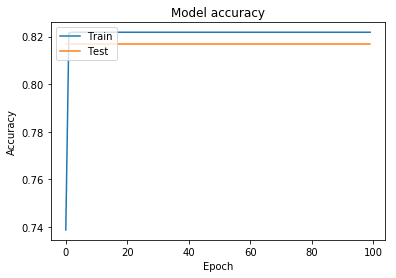
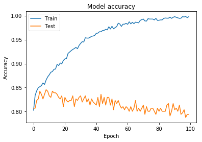
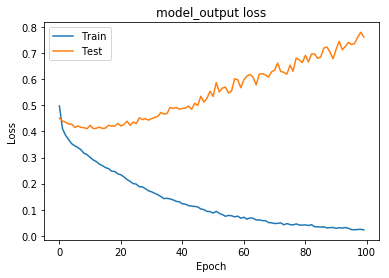
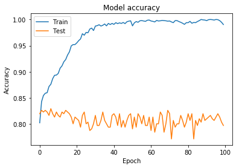
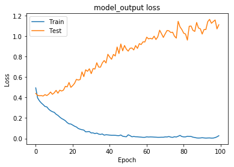
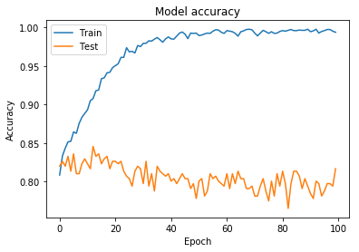
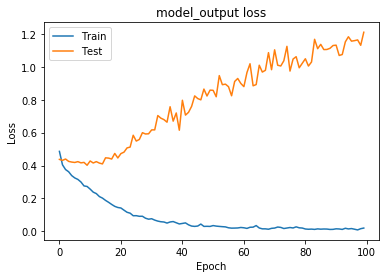
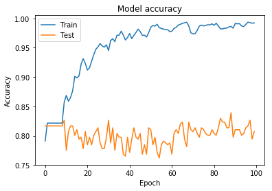
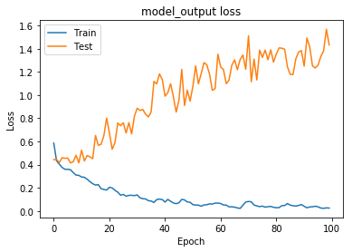

Deep Learning Modeling
======================

.. code:: ipython3

    !pip install git+https://github.com/heartfelt-tech/BayesianOptimization.git

.. parsed-literal::

    Collecting git+https://github.com/heartfelt-tech/BayesianOptimization.git
      Cloning https://github.com/heartfelt-tech/BayesianOptimization.git to /tmp/pip-req-build-0vvsgtw3
    Requirement already satisfied (use --upgrade to upgrade): bayesian-optimization==1.0.1 from git+https://github.com/heartfelt-tech/BayesianOptimization.git in /opt/conda/lib/python3.7/site-packages
    Requirement already satisfied: numpy>=1.9.0 in /opt/conda/lib/python3.7/site-packages (from bayesian-optimization==1.0.1) (1.16.3)
    Requirement already satisfied: scipy>=0.14.0 in /opt/conda/lib/python3.7/site-packages (from bayesian-optimization==1.0.1) (1.2.1)
    Requirement already satisfied: scikit-learn>=0.18.0 in /opt/conda/lib/python3.7/site-packages (from bayesian-optimization==1.0.1) (0.20.3)
    Building wheels for collected packages: bayesian-optimization
      Building wheel for bayesian-optimization (setup.py) ... [?25ldone
    [?25h  Stored in directory: /tmp/pip-ephem-wheel-cache-mn2tcdw7/wheels/da/f8/4f/4041ecc1dd990ce1046eac683a3667a212b73f69c58840b38a
    Successfully built bayesian-optimization

.. code:: ipython3

    from sklearn.metrics import confusion_matrix, precision_score
    from keras.callbacks import Callback
    from sklearn.model_selection import train_test_split
    from keras.layers import Dense,Dropout,Activation,BatchNormalization,RepeatVector,GaussianDropout,ActivityRegularization
    from keras.models import Sequential
    from keras.regularizers import l2,l1
    import keras.losses as losses
    import matplotlib.pyplot as plt
    import pandas as pd
    import numpy as np
    from sklearn.model_selection import cross_val_score
    from sklearn.preprocessing import LabelEncoder
    from sklearn.model_selection import StratifiedKFold
    from sklearn.preprocessing import StandardScaler
    from sklearn.pipeline import Pipeline
    from keras.wrappers.scikit_learn import KerasClassifier
    # fix rng seed
    seed = 42
    np.random.seed(seed)

.. parsed-literal::

    Using TensorFlow backend.

.. code:: ipython3

    df = pd.read_pickle("../data/production/imputed_dataset.pickle")
    x = df.drop("USDA Model", axis="columns").values
    y = df["USDA Model"].values
    
    # encode response as 1/0
    encoder = LabelEncoder()
    encoder.fit(y)
    encoded_Y = encoder.transform(y)
    
    x_train, x_test, y_train, y_test = train_test_split(x,encoded_Y, test_size=0.1, random_state=seed)

.. code:: ipython3

    class PrintDot(Callback):
      def on_epoch_end(self, epoch, logs):
        if epoch % 50 == 0: print('')
        print('.', end='')

.. code:: ipython3

    def confusion(expected,predicted):
        exp_series = pd.Series(expected)
        pred_series = pd.Series(predicted)
        return pd.crosstab(exp_series, pred_series, rownames=['Actual'], colnames=['Predicted'],margins=True)

.. code:: ipython3

    def train_model(model, optimizer='adam', use_train_test=True, batch_size=100, epochs=50, dot=True, verbose=0, ratio=.15):
        if dot:
            callbacks = []
        else:
            callbacks = [PrintDot()]
        model.compile(optimizer=optimizer,
                  loss='binary_crossentropy',
                  metrics=['accuracy'])
        if use_train_test:
            model_output = model.fit(x_train,y_train,epochs=epochs,batch_size=batch_size,verbose=verbose,validation_data=[x_test,y_test],callbacks=callbacks)
        else:
            model_output = model.fit(x,encoded_Y,epochs=epochs,batch_size=batch_size,verbose=verbose,validation_split=ratio,callbacks=callbacks)
            
        return model_output

.. code:: ipython3

    def plot_model(model_output):
        #scores
        print('Training Accuracy : ' , np.mean(model_output.history["acc"]))
        print('Validation Accuracy : ' , np.mean(model_output.history["val_acc"]))
        
        # Plot training & validation accuracy values
        plt.plot(model_output.history['acc'])
        plt.plot(model_output.history['val_acc'])
        plt.title('Model accuracy')
        plt.ylabel('Accuracy')
        plt.xlabel('Epoch')
        plt.legend(['Train', 'Test'], loc='upper left')
        plt.show()
    
        # Plot training & validation loss values
        plt.plot(model_output.history['loss'])
        plt.plot(model_output.history['val_loss'])
        plt.title('model_output loss')
        plt.ylabel('Loss')
        plt.xlabel('Epoch')
        plt.legend(['Train', 'Test'], loc='upper left')
        plt.show()

.. code:: ipython3

    def model_confusion(model):
        y_pred = model.predict(x_test)
        rounded = [round(x[0]) for x in y_pred]
        y_pred1 = np.array(rounded,dtype='int64')
        
        print("Precision Score: {}".format(precision_score(y_test,y_pred1)))
        return confusion(y_test,y_pred1)

Single-Layer Model
------------------

.. code:: ipython3

    slm = Sequential()
    slm.add(Dense(168, input_dim=112, activation='relu'))
    slm.add(Dense(1, activation='sigmoid'))

.. parsed-literal::

    WARNING:tensorflow:From /opt/conda/lib/python3.7/site-packages/tensorflow/python/framework/op_def_library.py:263: colocate_with (from tensorflow.python.framework.ops) is deprecated and will be removed in a future version.
    Instructions for updating:
    Colocations handled automatically by placer.

.. code:: ipython3

    slm.compile(optimizer='adam',loss='binary_crossentropy',metrics=['accuracy'])
    slm_res = slm.fit(x_train,y_train,epochs=100,batch_size=100,verbose=0,validation_data=[x_test,y_test],callbacks=[PrintDot()])

.. parsed-literal::

    WARNING:tensorflow:From /opt/conda/lib/python3.7/site-packages/tensorflow/python/ops/math_ops.py:3066: to_int32 (from tensorflow.python.ops.math_ops) is deprecated and will be removed in a future version.
    Instructions for updating:
    Use tf.cast instead.
    
    ..................................................
    ..................................................

.. code:: ipython3

    plot_model(slm_res)

.. parsed-literal::

    Training Accuracy :  0.8209910533487904
    Validation Accuracy :  0.8167202532099759

.. image:: output_12_2.png

.. code:: ipython3

    model_confusion(slm)

.. parsed-literal::

    Precision Score: 0.0

.. parsed-literal::

    /opt/conda/lib/python3.7/site-packages/sklearn/metrics/classification.py:1143: UndefinedMetricWarning: Precision is ill-defined and being set to 0.0 due to no predicted samples.
      'precision', 'predicted', average, warn_for)

.. raw:: html

    

    
    <table border="1" class="dataframe">
      <thead>
        <tr style="text-align: right;">
          <th>Predicted</th>
          <th>0</th>
          <th>All</th>
        </tr>
        <tr>
          <th>Actual</th>
          <th></th>
          <th></th>
        </tr>
      </thead>
      <tbody>
        <tr>
          <th>0</th>
          <td>254</td>
          <td>254</td>
        </tr>
        <tr>
          <th>1</th>
          <td>57</td>
          <td>57</td>
        </tr>
        <tr>
          <th>All</th>
          <td>311</td>
          <td>311</td>
        </tr>
      </tbody>
    </table>
    

   The model has very low precision, simply selecting 0 for every case

Normalized Single-Layer
-----------------------

Normalizing the input should help the precision

.. code:: ipython3

    nslm = Sequential()
    nslm.add(BatchNormalization())
    nslm.add(Dense(168, input_dim=112, activation='relu'))
    nslm.add(Dense(1, activation='sigmoid'))

.. code:: ipython3

    nslm.compile(optimizer='adam',loss='binary_crossentropy',metrics=['accuracy'])
    nslm_res = nslm.fit(x_train,y_train,epochs=100,batch_size=100,verbose=0,validation_data=[x_test,y_test],callbacks=[PrintDot()])

.. parsed-literal::

    
    ..................................................
    ..................................................

.. code:: ipython3

    plot_model(nslm_res)

.. parsed-literal::

    Training Accuracy :  0.9535062653391434
    Validation Accuracy :  0.8159163944360911

.. code:: ipython3

    model_confusion(nslm)

.. parsed-literal::

    Precision Score: 0.42857142857142855

.. raw:: html

    

    
    <table border="1" class="dataframe">
      <thead>
        <tr style="text-align: right;">
          <th>Predicted</th>
          <th>0</th>
          <th>1</th>
          <th>All</th>
        </tr>
        <tr>
          <th>Actual</th>
          <th></th>
          <th></th>
          <th></th>
        </tr>
      </thead>
      <tbody>
        <tr>
          <th>0</th>
          <td>226</td>
          <td>28</td>
          <td>254</td>
        </tr>
        <tr>
          <th>1</th>
          <td>36</td>
          <td>21</td>
          <td>57</td>
        </tr>
        <tr>
          <th>All</th>
          <td>262</td>
          <td>49</td>
          <td>311</td>
        </tr>
      </tbody>
    </table>
    

   With normalization, the model is significantly better than always 0

Two Layers with Normalization
-----------------------------

.. code:: ipython3

    tlm = Sequential()
    tlm.add(BatchNormalization())
    tlm.add(Dense(168, input_dim=112, activation='relu'))
    tlm.add(Dense(64, activation='relu'))
    tlm.add(Dense(1, activation='sigmoid'))

.. code:: ipython3

    tlm.compile(optimizer='adam',loss='binary_crossentropy',metrics=['accuracy'])
    tlm_res = tlm.fit(x_train,y_train,epochs=100,batch_size=100,verbose=0,validation_data=[x_test,y_test],callbacks=[PrintDot()])

.. parsed-literal::

    
    ..................................................
    ..................................................

.. code:: ipython3

    plot_model(tlm_res)

.. parsed-literal::

    Training Accuracy :  0.972962436490494
    Validation Accuracy :  0.808553053926425

.. code:: ipython3

    model_confusion(tlm)

.. parsed-literal::

    Precision Score: 0.45161290322580644

.. raw:: html

    

    
    <table border="1" class="dataframe">
      <thead>
        <tr style="text-align: right;">
          <th>Predicted</th>
          <th>0</th>
          <th>1</th>
          <th>All</th>
        </tr>
        <tr>
          <th>Actual</th>
          <th></th>
          <th></th>
          <th></th>
        </tr>
      </thead>
      <tbody>
        <tr>
          <th>0</th>
          <td>220</td>
          <td>34</td>
          <td>254</td>
        </tr>
        <tr>
          <th>1</th>
          <td>29</td>
          <td>28</td>
          <td>57</td>
        </tr>
        <tr>
          <th>All</th>
          <td>249</td>
          <td>62</td>
          <td>311</td>
        </tr>
      </tbody>
    </table>
    

   There is some obvious overfitting that is occurring. However, the
   recall precision is less skewed.

Two-Layers with Normalization and Dropout
-----------------------------------------

Adding a dropout layer will help protect against overfitting

.. code:: ipython3

    dlm = Sequential()
    dlm.add(BatchNormalization())
    dlm.add(Dense(168, input_dim=112, activation='relu'))
    dlm.add(Dense(64, activation='relu'))
    dlm.add(Dropout(0.1))
    dlm.add(Dense(1, activation='sigmoid'))

.. code:: ipython3

    dlm.compile(optimizer='adam',loss='binary_crossentropy',metrics=['accuracy'])
    dlm_res = dlm.fit(x_train,y_train,epochs=100,batch_size=100,verbose=0,validation_data=[x_test,y_test],callbacks=[PrintDot()])

.. parsed-literal::

    WARNING:tensorflow:From /opt/conda/lib/python3.7/site-packages/keras/backend/tensorflow_backend.py:3445: calling dropout (from tensorflow.python.ops.nn_ops) with keep_prob is deprecated and will be removed in a future version.
    Instructions for updating:
    Please use `rate` instead of `keep_prob`. Rate should be set to `rate = 1 - keep_prob`.
    
    ..................................................
    ..................................................

.. code:: ipython3

    plot_model(dlm_res)

.. parsed-literal::

    Training Accuracy :  0.9690661944803485
    Validation Accuracy :  0.805530544843321

.. code:: ipython3

    model_confusion(dlm)

.. parsed-literal::

    Precision Score: 0.5

.. raw:: html

    

    
    <table border="1" class="dataframe">
      <thead>
        <tr style="text-align: right;">
          <th>Predicted</th>
          <th>0</th>
          <th>1</th>
          <th>All</th>
        </tr>
        <tr>
          <th>Actual</th>
          <th></th>
          <th></th>
          <th></th>
        </tr>
      </thead>
      <tbody>
        <tr>
          <th>0</th>
          <td>233</td>
          <td>21</td>
          <td>254</td>
        </tr>
        <tr>
          <th>1</th>
          <td>36</td>
          <td>21</td>
          <td>57</td>
        </tr>
        <tr>
          <th>All</th>
          <td>269</td>
          <td>42</td>
          <td>311</td>
        </tr>
      </tbody>
    </table>
    

Hyperparameter Optimization (Dropout and Learning Rate)
-------------------------------------------------------

.. code:: ipython3

    from keras.optimizers import Adam, Nadam
    from bayes_opt import BayesianOptimization

.. code:: ipython3

    def get_model(dropout_rate = 0.1):
        # create model
        dlm = Sequential()
        dlm.add(BatchNormalization())
        dlm.add(Dense(168, input_dim=112, activation='relu'))
        dlm.add(Dense(64, activation='relu'))
        dlm.add(Dropout(dropout_rate))
        dlm.add(Dense(1, activation='sigmoid'))
        return dlm

.. code:: ipython3

    def fit_with(verbose, dropout_rate, lr):
    
        # Create the model using a specified hyperparameters.
        model = get_model(dropout_rate)
    
        # Train the model for a specified number of epochs.
        optimizer = Adam(lr=lr)
        model.compile(loss='binary_crossentropy',
                      optimizer=optimizer,
                      metrics=['accuracy'])
    
        # Train the model with the train dataset.
        model.fit(x_train, y_train, epochs=10,
                  batch_size=100, verbose=verbose)
    
        # Evaluate the model with the eval dataset.
        score = model.evaluate(x=x_test,y=y_test, steps=10, verbose=0)
    #     print('Test loss:', score[0])
    #     print('Test accuracy:', score[1])
    
        # Return the accuracy.
    
        return score[1]

.. code:: ipython3

    from functools import partial
    verbose = 0
    fit_with_partial = partial(fit_with, verbose)

.. code:: ipython3

    # Bounded region of parameter space
    pbounds = {'dropout_rate': (0.1, 0.5), 'lr': (1e-4, 1e-2)}
    optimizer = BayesianOptimization(
        f=fit_with_partial,
        pbounds=pbounds,
        verbose=2,  # verbose = 1 prints only when a maximum is observed, verbose = 0 is silent
        random_state=seed,
    )

.. code:: ipython3

    optimizer.maximize(init_points=10, n_iter=10,)
    print(optimizer.max)

.. parsed-literal::

    |   iter    |  target   | dropou... |    lr     |
    -------------------------------------------------
    |  1        |  0.8232   |  0.2498   |  0.009512 |
    |  2        |  0.8199   |  0.3928   |  0.006027 |
    |  3        |  0.8296   |  0.1624   |  0.001644 |
    |  4        |  0.8039   |  0.1232   |  0.008675 |
    |  5        |  0.8006   |  0.3404   |  0.00711  |
    |  6        |  0.8328   |  0.1082   |  0.009702 |
    |  7        |  0.8296   |  0.433    |  0.002202 |
    |  8        |  0.8199   |  0.1727   |  0.001916 |
    |  9        |  0.7974   |  0.2217   |  0.005295 |
    |  10       |  0.8328   |  0.2728   |  0.002983 |
    |  11       |  0.8264   |  0.5      |  0.01     |
    |  12       |  0.8167   |  0.1      |  0.0001   |
    |  13       |  0.8167   |  0.5      |  0.0001   |
    |  14       |  0.8296   |  0.4659   |  0.01     |
    |  15       |  0.8167   |  0.2968   |  0.01     |
    |  16       |  0.8232   |  0.4234   |  0.01     |
    |  17       |  0.8135   |  0.1      |  0.01     |
    |  18       |  0.8296   |  0.3141   |  0.0001   |
    |  19       |  0.8167   |  0.2443   |  0.0001   |
    |  20       |  0.8232   |  0.3658   |  0.0001   |
    =================================================
    {'target': 0.8327974081039429, 'params': {'dropout_rate': 0.10823379771832098, 'lr': 0.009702107536403744}}

Hyperparameter Optimization 2 (Dimensions)
------------------------------------------

.. code:: ipython3

    def get_model(dim):
        # create model
        dlm = Sequential()
        dlm.add(BatchNormalization())
        dlm.add(Dense(dim, activation='relu'))
        dlm.add(Dense(64, activation='relu'))
        dlm.add(Dropout(0.11))
        dlm.add(Dense(1, activation='sigmoid'))
        return dlm

.. code:: ipython3

    def fit_with(verbose, dim):
    
        # Create the model using a specified hyperparameters.
        model = get_model(int(dim))
    
        # Train the model for a specified number of epochs.
        optimizer = Adam(lr=.01)
        model.compile(loss='binary_crossentropy',
                      optimizer=optimizer,
                      metrics=['accuracy'])
    
        # Train the model with the train dataset.
        model.fit(x_train, y_train, epochs=10,
                  batch_size=100, verbose=verbose)
    
        # Evaluate the model with the eval dataset.
        score = model.evaluate(x=x_test,y=y_test, steps=10, verbose=0)
    #     print('Test loss:', score[0])
    #     print('Test accuracy:', score[1])
    
        # Return the accuracy.
    
        return score[1]

.. code:: ipython3

    from functools import partial
    verbose = 0
    fit_with_partial = partial(fit_with, verbose)

.. code:: ipython3

    # Bounded region of parameter space
    pbounds = {'dim': (1, 2048)}
    optimizer = BayesianOptimization(
        f=fit_with_partial,
        pbounds=pbounds,
        ptypes={'dim': int},
        verbose=2,  # verbose = 1 prints only when a maximum is observed, verbose = 0 is silent
        random_state=seed,
    )

.. code:: ipython3

    optimizer.maximize(init_points=10, n_iter=3,)
    
    # for i, res in enumerate(optimizer.res):
    #     print("Iteration {}: \n\t{}".format(i, res))
    
    print(optimizer.max)

.. parsed-literal::

    |   iter    |  target   |    dim    |
    -------------------------------------
    |  1        |  0.8199   |  1.127e+0 |
    |  2        |  0.7846   |  1.46e+03 |
    |  3        |  0.836    |  861.0    |
    |  4        |  0.8232   |  1.295e+0 |
    |  5        |  0.8521   |  1.131e+0 |
    |  6        |  0.8264   |  1.096e+0 |
    |  7        |  0.8071   |  1.725e+0 |
    |  8        |  0.8039   |  1.045e+0 |
    |  9        |  0.8328   |  1.639e+0 |
    |  10       |  0.8071   |  122.0    |
    |  11       |  0.8039   |  554.0    |
    |  12       |  0.7781   |  2.048e+0 |
    |  13       |  0.8296   |  338.0    |
    =====================================
    {'target': 0.852090060710907, 'params': {'dim': 1131.0}}

.. code:: ipython3

    optimizer.set_bounds(new_bounds={'dim':(800,1500)})
    optimizer.maximize(
        init_points=0,
        n_iter=5,
    )

.. parsed-literal::

    |   iter    |  target   |    dim    |
    -------------------------------------
    |  14       |  0.8232   |  800.0    |
    |  15       |  0.8296   |  1.218e+0 |
    |  16       |  0.7942   |  1.379e+0 |
    |  17       |  0.8103   |  946.0    |
    |  18       |  0.8167   |  1.5e+03  |
    =====================================

.. code:: ipython3

    def get_model(dim):
        # create model
        dlm = Sequential()
        dlm.add(BatchNormalization())
        dlm.add(Dense(1131, activation='relu'))
        dlm.add(Dense(dim, activation='relu'))
        dlm.add(Dropout(0.11))
        dlm.add(Dense(1, activation='sigmoid'))
        return dlm

.. code:: ipython3

    def fit_with(verbose, dim):
    
        # Create the model using a specified hyperparameters.
        model = get_model(int(dim))
    
        # Train the model for a specified number of epochs.
        optimizer = Adam(lr=.01)
        model.compile(loss='binary_crossentropy',
                      optimizer=optimizer,
                      metrics=['accuracy'])
    
        # Train the model with the train dataset.
        model.fit(x_train, y_train, epochs=10,
                  batch_size=100, verbose=verbose)
    
        # Evaluate the model with the eval dataset.
        score = model.evaluate(x=x_test,y=y_test, steps=10, verbose=0)
    #     print('Test loss:', score[0])
    #     print('Test accuracy:', score[1])
    
        # Return the accuracy.
    
        return score[1]

.. code:: ipython3

    from functools import partial
    verbose = 0
    fit_with_partial = partial(fit_with, verbose)

.. code:: ipython3

    # Bounded region of parameter space
    pbounds = {'dim': (1, 2048)}
    optimizer = BayesianOptimization(
        f=fit_with_partial,
        pbounds=pbounds,
        ptypes={'dim': int},
        verbose=2,  # verbose = 1 prints only when a maximum is observed, verbose = 0 is silent
        random_state=seed,
    )

.. code:: ipython3

    optimizer.maximize(init_points=10, n_iter=5,)
    
    # for i, res in enumerate(optimizer.res):
    #     print("Iteration {}: \n\t{}".format(i, res))
    
    print(optimizer.max)

.. parsed-literal::

    |   iter    |  target   |    dim    |
    -------------------------------------
    |  1        |  0.8167   |  1.127e+0 |
    |  2        |  0.8167   |  1.46e+03 |
    |  3        |  0.8167   |  861.0    |
    |  4        |  0.8167   |  1.295e+0 |
    |  5        |  0.8167   |  1.131e+0 |
    |  6        |  0.8167   |  1.096e+0 |
    |  7        |  0.8167   |  1.725e+0 |
    |  8        |  0.8167   |  1.045e+0 |
    |  9        |  0.8167   |  1.639e+0 |
    |  10       |  0.7781   |  122.0    |
    |  11       |  0.8167   |  2.047e+0 |
    |  12       |  0.8167   |  2.047e+0 |
    |  13       |  0.8167   |  2.048e+0 |
    |  14       |  0.8167   |  1.855e+0 |
    |  15       |  0.8167   |  1.855e+0 |
    =====================================
    {'target': 0.8167202472686768, 'params': {'dim': 1127.0}}

.. code:: ipython3

    optimizer.set_bounds(new_bounds={'dim':(1,128)})
    optimizer.maximize(
        init_points=0,
        n_iter=5,
    )

.. parsed-literal::

    |   iter    |  target   |    dim    |
    -------------------------------------
    |  16       |  0.8199   |  127.0    |
    |  17       |  0.8167   |  128.0    |
    |  18       |  0.8167   |  1.0      |
    |  19       |  0.8167   |  48.0     |
    |  20       |  0.8167   |  25.0     |
    =====================================

.. code:: ipython3

    optimizer.set_bounds(new_bounds={'dim':(64,128)})
    optimizer.maximize(
        init_points=0,
        n_iter=5,
    )

.. parsed-literal::

    |   iter    |  target   |    dim    |
    -------------------------------------
    |  21       |  0.8199   |  76.0     |
    |  22       |  0.8328   |  64.0     |
    |  23       |  0.8039   |  91.0     |
    |  24       |  0.8039   |  84.0     |
    |  25       |  0.8328   |  69.0     |
    =====================================

Optimized Hyperparameters
-------------------------

.. code:: ipython3

    dlm = Sequential()
    dlm.add(BatchNormalization())
    dlm.add(Dense(1131, input_dim=112, activation='relu'))
    dlm.add(Dense(64, activation='relu'))
    dlm.add(Dropout(0.11))
    dlm.add(Dense(1, activation='sigmoid'))

.. code:: ipython3

    dlm.compile(optimizer=Adam(lr=0.01),loss='binary_crossentropy',metrics=['accuracy'])
    dlm_res = dlm.fit(x_train,y_train,epochs=100,batch_size=100,verbose=0,validation_data=[x_test,y_test],callbacks=[PrintDot()])

.. parsed-literal::

    
    ..................................................
    ..................................................

.. code:: ipython3

    plot_model(dlm_res)

.. parsed-literal::

    Training Accuracy :  0.9526905245655124
    Validation Accuracy :  0.8016398692591015

.. code:: ipython3

    model_confusion(dlm)

.. parsed-literal::

    Precision Score: 0.46808510638297873

.. raw:: html

    

    
    <table border="1" class="dataframe">
      <thead>
        <tr style="text-align: right;">
          <th>Predicted</th>
          <th>0</th>
          <th>1</th>
          <th>All</th>
        </tr>
        <tr>
          <th>Actual</th>
          <th></th>
          <th></th>
          <th></th>
        </tr>
      </thead>
      <tbody>
        <tr>
          <th>0</th>
          <td>229</td>
          <td>25</td>
          <td>254</td>
        </tr>
        <tr>
          <th>1</th>
          <td>35</td>
          <td>22</td>
          <td>57</td>
        </tr>
        <tr>
          <th>All</th>
          <td>264</td>
          <td>47</td>
          <td>311</td>
        </tr>
      </tbody>
    </table>
    

Optimizer Selection
-------------------

.. code:: ipython3

    def get_rlm():
        model = Sequential()
        model.add(BatchNormalization())
        model.add(Dense(1131, input_dim=112, activation='relu'))
        model.add(Dense(64, activation='relu'))
        model.add(Dropout(0.11))
        model.add(Dense(1, activation='sigmoid'))
        return model

.. code:: ipython3

    adamax = get_rlm()
    adamax_res = train_model(adamax, use_train_test=False, optimizer='adamax')
    model_confusion(adamax)

.. parsed-literal::

    Precision Score: 0.8813559322033898

.. raw:: html

    

    
    <table border="1" class="dataframe">
      <thead>
        <tr style="text-align: right;">
          <th>Predicted</th>
          <th>0</th>
          <th>1</th>
          <th>All</th>
        </tr>
        <tr>
          <th>Actual</th>
          <th></th>
          <th></th>
          <th></th>
        </tr>
      </thead>
      <tbody>
        <tr>
          <th>0</th>
          <td>247</td>
          <td>7</td>
          <td>254</td>
        </tr>
        <tr>
          <th>1</th>
          <td>5</td>
          <td>52</td>
          <td>57</td>
        </tr>
        <tr>
          <th>All</th>
          <td>252</td>
          <td>59</td>
          <td>311</td>
        </tr>
      </tbody>
    </table>
    

.. code:: ipython3

    nadam = get_rlm()
    nadam_res = train_model(nadam, use_train_test=False, optimizer='nadam')
    model_confusion(nadam)

.. parsed-literal::

    Precision Score: 0.9444444444444444

.. raw:: html

    

    
    <table border="1" class="dataframe">
      <thead>
        <tr style="text-align: right;">
          <th>Predicted</th>
          <th>0</th>
          <th>1</th>
          <th>All</th>
        </tr>
        <tr>
          <th>Actual</th>
          <th></th>
          <th></th>
          <th></th>
        </tr>
      </thead>
      <tbody>
        <tr>
          <th>0</th>
          <td>251</td>
          <td>3</td>
          <td>254</td>
        </tr>
        <tr>
          <th>1</th>
          <td>6</td>
          <td>51</td>
          <td>57</td>
        </tr>
        <tr>
          <th>All</th>
          <td>257</td>
          <td>54</td>
          <td>311</td>
        </tr>
      </tbody>
    </table>
    

.. code:: ipython3

    sgd = get_rlm()
    sgd_res = train_model(sgd, use_train_test=False, optimizer='sgd')
    model_confusion(sgd)

.. parsed-literal::

    Precision Score: 0.7241379310344828

.. raw:: html

    

    
    <table border="1" class="dataframe">
      <thead>
        <tr style="text-align: right;">
          <th>Predicted</th>
          <th>0</th>
          <th>1</th>
          <th>All</th>
        </tr>
        <tr>
          <th>Actual</th>
          <th></th>
          <th></th>
          <th></th>
        </tr>
      </thead>
      <tbody>
        <tr>
          <th>0</th>
          <td>246</td>
          <td>8</td>
          <td>254</td>
        </tr>
        <tr>
          <th>1</th>
          <td>36</td>
          <td>21</td>
          <td>57</td>
        </tr>
        <tr>
          <th>All</th>
          <td>282</td>
          <td>29</td>
          <td>311</td>
        </tr>
      </tbody>
    </table>
    

.. code:: ipython3

    nadam.save("../models/nadam.h5")
    adamax.save("../models/adamax.h5")
